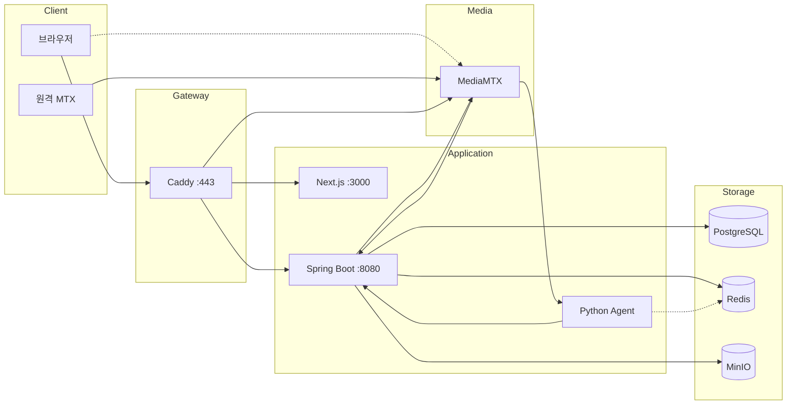
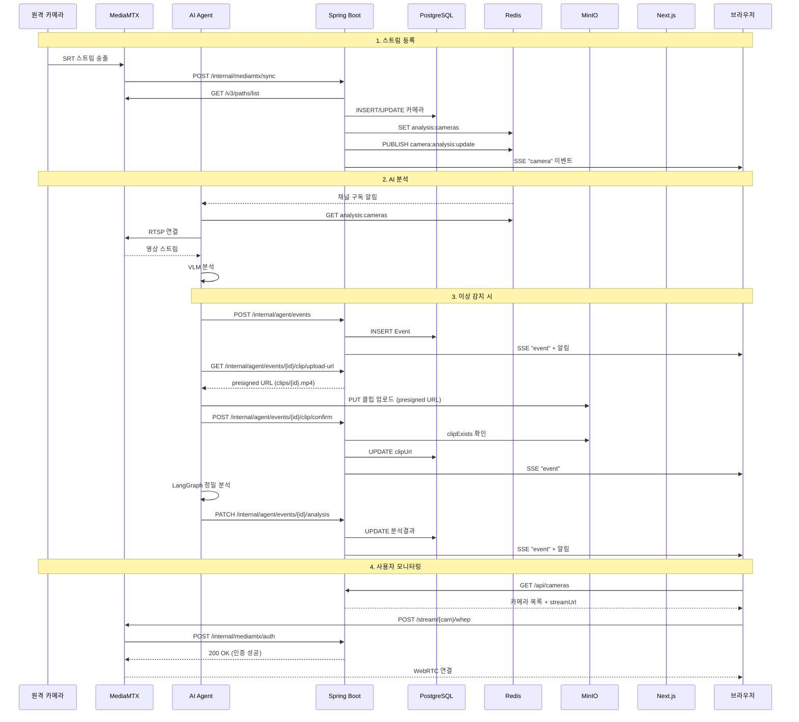

# AEGIS Infrastructure

> Agent 기반 안전 모니터링 시스템 - 인프라 구성

## 개요

AEGIS Infrastructure는 Docker Compose 기반의 인프라 구성으로, 리버스 프록시, 미디어 서버, 데이터베이스, 오브젝트 스토리지, 캐시를 포함합니다.

## 시스템 아키텍처

### 전체 구성도



### 서비스 포트

| 서비스 | 포트 | 설명 |
|--------|------|------|
| Caddy | 443 | HTTPS 리버스 프록시 |
| Next.js | 3000 | 프론트엔드 |
| Spring Boot | 8080 | 백엔드 API |
| Python Agent | - | AI 분석 (포트 미노출) |
| PostgreSQL | 5432 | 데이터베이스 |
| Redis | 6379 | 캐시/토큰/Pub-Sub |
| MinIO API | 9000 | 클립 스토리지 |
| MinIO Console | 9001 | 웹 관리 콘솔 |

### MediaMTX 포트

| 프로토콜 | 포트 | 용도 |
|----------|------|------|
| SRT | 8890/udp | 원격 MTX에서 스트림 수신 |
| WebRTC WHEP | 8889 | 시그널링 |
| WebRTC ICE | 8189/udp | 미디어 |
| RTSP | 8554 | Python Agent 프레임 캡처용 (내부) |
| API | 9997 | 카메라 목록 조회 |

## 워크플로우

### WebRTC 스트리밍 흐름

```
1. 브라우저 → Spring Boot: GET /api/cameras → 카메라 목록 + streamUrl 반환
2. 브라우저 → MediaMTX: POST /stream/{cam}/whep + Authorization: Basic base64(_:jwt)
3. MediaMTX → Spring Boot: POST /internal/mediamtx/auth (password=jwt)
4. Spring Boot: JWT 검증 → 카메라 접근 권한 확인
5. 브라우저 ↔ MediaMTX: UDP ICE 직접 연결 (DTLS 암호화)
```

### 카메라 동기화 흐름

```
1. 원격 MTX → MediaMTX: SRT 스트림 송출
2. MediaMTX: runOnReady 훅 실행
3. MediaMTX → Spring Boot: POST /internal/mediamtx/sync
4. Spring Boot → MediaMTX: GET /v3/paths/list
5. Spring Boot → PostgreSQL: 카메라 INSERT/UPDATE
6. Spring Boot → Redis: 분석 카메라 목록 저장 (analysis:cameras)
7. Spring Boot → Redis: Pub/Sub camera:analysis:update 발행
8. Spring Boot → 브라우저: SSE camera 이벤트
```

### AI 분석 흐름

```
1. Agent: Redis camera:analysis:update 채널 구독
2. Agent: Redis에서 분석 카메라 목록 조회 (GET analysis:cameras)
3. Agent: RTSP로 MediaMTX에 직접 연결 (rtsp://localhost:8554/{cam}, 인증 없음)
4. Agent: PyAV로 30초 클립 버퍼 유지 + 1fps 프레임 캡처
5. Agent: VLM 1차 분석 수행
6. [이상 감지 시] Agent → Spring Boot: POST /internal/agent/events → Event 생성 (event_id 획득)
7. Agent → Spring Boot: GET /internal/agent/events/{id}/clip/upload-url → presigned URL 획득
8. Agent → MinIO: presigned URL로 clips/{event_id}.mp4 직접 업로드
9. Agent → Spring Boot: POST /internal/agent/events/{id}/clip/confirm → 클립 확정 (clipUrl 저장)
10. Agent: LangGraph 정밀 분석 파이프라인 실행
11. Agent → Spring Boot: PATCH /internal/agent/events/{id}/analysis → 분석 결과 추가
```

### 인증 흐름

```
1. 로그인 → Access Token (응답 body) + Refresh Token (Redis + Cookie)
2. API 호출 → Authorization: Bearer {accessToken}
3. 401 응답 → Refresh Token으로 갱신 시도
4. 갱신 실패 → /auth로 리다이렉트
```

---

## 전체 시스템 통합

### 컴포넌트별 역할

| 컴포넌트 | 역할 | 통신 대상 |
|----------|------|-----------|
| **Caddy** | HTTPS 종단, 라우팅 | Frontend, Backend, MediaMTX |
| **Frontend** | 사용자 인터페이스, WebRTC 재생 | Backend(API), MediaMTX(WebRTC) |
| **Backend** | REST API, 인증, 데이터 관리 | PostgreSQL, Redis, MinIO, MediaMTX |
| **AI Agent** | 영상 분석, 이벤트 생성 | Backend(webhook), MediaMTX(RTSP), Redis(Pub/Sub) |
| **MediaMTX** | 스트림 수신/변환/송출 | Backend(인증), Agent(RTSP) |
| **PostgreSQL** | 영구 데이터 저장 | Backend |
| **Redis** | 토큰, 캐시, Pub/Sub | Backend, Agent |
| **MinIO** | 클립 영상 저장 | Backend, Agent |

### 데이터 흐름 상세



### Redis 키/채널 설계

| 키/채널 | 타입 | 용도 | 생산자 | 소비자 |
|---------|------|------|--------|--------|
| `refresh_token:{token}` | String | 토큰→사용자 매핑 | Backend | Backend |
| `mediamtx:sync:lock` | String | 동기화 중복 방지 | Backend | Backend |
| `analysis:cameras` | String(JSON) | 분석 대상 카메라 | Backend | Agent |
| `camera:analysis:update` | Pub/Sub | 카메라 변경 알림 | Backend | Agent |

### MinIO 버킷 구조

```
aegis/
├── clips/                      # 이벤트 클립 (Agent가 presigned URL로 직접 업로드)
│   └── {event_id}.mp4
└── temp/
    └── clips/                  # 미사용 (고아 경로, 매 시간 정리 스케줄러 존재)
        └── {event_id}.mp4
```

**참고**: Agent는 `clips/` 경로에 직접 업로드합니다. `temp/clips/`는 현재 사용되지 않으며, 관련 S3Service 메서드(`tempClipExists`, `moveClipFromTemp`)도 호출되지 않습니다.

---

## 아키텍처 (ASCII)

```
                    ┌─────────────────────────────────────────┐
                    │              Caddy (443)                │
                    │           리버스 프록시, HTTPS           │
                    └────────────────┬────────────────────────┘
                                     │
            ┌────────────────────────┼────────────────────────┐
            │                        │                        │
            ▼                        ▼                        ▼
    ┌───────────────┐      ┌─────────────────┐      ┌─────────────────┐
    │   Frontend    │      │    Backend      │      │   MediaMTX      │
    │   (3000)      │      │    (8080)       │      │  (8889/8554)    │
    │  host.docker  │      │  host.docker    │      │                 │
    └───────────────┘      └────────┬────────┘      └─────────────────┘
                                    │
                    ┌───────────────┼───────────────┐
                    │               │               │
                    ▼               ▼               ▼
            ┌───────────┐   ┌───────────┐   ┌───────────┐
            │ PostgreSQL│   │   Redis   │   │   MinIO   │
            │  (5432)   │   │  (6379)   │   │(9000/9001)│
            └───────────┘   └───────────┘   └───────────┘
```

## 서비스 구성

### docker-compose.yml

| 서비스 | 이미지 | 포트 | 설명 |
|--------|--------|------|------|
| caddy | caddy:latest | 443 | 리버스 프록시, HTTPS |
| mediamtx | bluenviron/mediamtx:latest-ffmpeg | 9997, 8554, 8889, 8189/udp, 8890/udp | 미디어 서버 |
| postgres | postgres:latest | 5432 | 데이터베이스 |
| minio | minio/minio:latest | 9000, 9001 | 오브젝트 스토리지 |
| redis | redis:latest | 6379 | 캐시 |

## 네트워크

- **네트워크 이름**: `aegis`
- **드라이버**: bridge
- **호스트 접근**: `host.docker.internal`

## Caddy (리버스 프록시)

### 포트

- **443**: HTTPS (TLS internal - 자체 서명 인증서)

### Caddyfile 라우팅

```
localhost {
    tls internal

    # Backend API
    handle /api/* {
        reverse_proxy host.docker.internal:8080
    }

    # MediaMTX WebRTC
    handle /stream/* {
        uri strip_prefix /stream
        reverse_proxy aegis-mediamtx:8889
    }

    # Frontend
    handle {
        reverse_proxy host.docker.internal:3000
    }
}
```

### 볼륨

| 호스트 | 컨테이너 | 설명 |
|--------|----------|------|
| ./Caddyfile | /etc/caddy/Caddyfile | 설정 파일 |
| ./caddy_data | /data | 인증서 등 |
| ./caddy_config | /config | 설정 캐시 |

## MediaMTX (미디어 서버)

### 이미지

공식 이미지 사용: `bluenviron/mediamtx:latest-ffmpeg`

> 이전에는 curl 설치를 위해 커스텀 Dockerfile을 사용했으나, wget을 사용하는 방식으로 변경하여 공식 이미지를 직접 사용합니다.

### 포트

| 포트 | 프로토콜 | 용도 |
|------|----------|------|
| 9997 | TCP | API |
| 8554 | TCP | RTSP (Python Agent 프레임 캡처) |
| 8889 | TCP | WebRTC WHEP (Frontend 스트리밍) |
| 8189 | UDP | WebRTC ICE |
| 8890 | UDP | SRT (외부 스트림 수신) |

### 환경 변수 설정

mediamtx.yml 파일 대신 환경 변수로 설정합니다:

```yaml
environment:
  # 로그 및 기본 설정
  MTX_LOGLEVEL: "info"
  MTX_API: "yes"
  
  # 프로토콜 설정
  MTX_RTMP: "no"
  MTX_SRT: "yes"
  MTX_RTSP: "yes"
  MTX_WEBRTC: "yes"
  
  # WebRTC 설정
  MTX_WEBRTCADDITIONALHOSTS: "127.0.0.1"
  

  # 인증 설정 (Spring Backend 위임)
  MTX_AUTHMETHOD: "http"
  MTX_AUTHHTTPADDRESS: "http://host.docker.internal:8080/internal/mediamtx/auth"
  
  # 이벤트 훅 (wget 사용)
  MTX_PATHS_ALL_RUNONREADY: "wget -q -O - --header='Content-Type: application/json' --post-data='{}' http://host.docker.internal:8080/internal/mediamtx/sync"
  MTX_PATHS_ALL_RUNONREADYRESTART: "no"
  MTX_PATHS_ALL_RUNONNOTREADY: "wget -q -O - --header='Content-Type: application/json' --post-data='{}' http://host.docker.internal:8080/internal/mediamtx/sync"
```

### 인증 설정

모든 인증을 Spring Boot로 위임하여 통합 관리합니다.

**프로토콜별 인증 처리:**

| 프로토콜 | action | 인증 방식 | 설명 |
|----------|--------|-----------|------|
| SRT | publish | ID/PW | `streamid=publish:path:user:password` 형식 |
| RTSP | read | 없음 | Python Agent 프레임 캡처용 (내부) |
| WebRTC | read | JWT | Basic Auth password 필드에 JWT 전달 |

**SRT 송출 URL 형식:**

```
srt://host:8890?streamid=publish:카메라명:사용자:비밀번호
```

예시: `srt://host:8890?streamid=publish:cam1:aegis:trillion`


## PostgreSQL

### 포트

- **5432**: PostgreSQL 기본 포트

### 환경 변수

| 변수 | 값 |
|------|-----|
| POSTGRES_USER | aegis |
| POSTGRES_PASSWORD | trillion |
| POSTGRES_DB | aegis |

### 볼륨

| 호스트 | 컨테이너 | 설명 |
|--------|----------|------|
| ./postgres_data | /var/lib/postgresql | 데이터 |

## MinIO (S3 호환 스토리지)

### 포트

| 포트 | 용도 |
|------|------|
| 9000 | S3 API |
| 9001 | 웹 콘솔 |

### 환경 변수

| 변수 | 값 |
|------|-----|
| MINIO_ROOT_USER | aegis |
| MINIO_ROOT_PASSWORD | trillion |

### 볼륨

| 호스트 | 컨테이너 | 설명 |
|--------|----------|------|
| ./minio_data | /data | 데이터 |

### 버킷

- **aegis**: 기본 버킷

### 클립 저장 구조

```
aegis/
├── clips/                  # 확정된 이벤트 클립
│   └── {event_id}.mp4
└── temp/
    └── clips/              # Python Agent 임시 저장 (매 시간 정리)
        └── {event_id}.mp4
```

## Redis

### 포트

- **6379**: Redis 기본 포트

### 볼륨

| 호스트 | 컨테이너 | 설명 |
|--------|----------|------|
| ./redis_data | /data | 데이터 (dump.rdb) |

### 용도

- Refresh Token 저장
- MediaMTX 동기화 잠금
- 분석 카메라 목록
- Pub/Sub (AI Agent 알림)

## 볼륨 및 데이터 관리

### 디렉토리 구조

```
aegis-infra/
├── Caddyfile
├── docker-compose.yml
├── README.md
├── minio_data/         # MinIO 데이터
│   └── aegis/          # 기본 버킷
├── postgres_data/      # PostgreSQL 데이터
└── redis_data/         # Redis 데이터
    └── dump.rdb
```

### 데이터 초기화

```bash
# 모든 데이터 삭제 (주의!)
rm -rf postgres_data/* minio_data/* redis_data/* mediamtx_data/*
```

## 실행 방법

### 시작

```bash
# 전체 서비스 시작
docker-compose up -d

# 로그 확인
docker-compose logs -f

# 특정 서비스 로그
docker-compose logs -f mediamtx
```

### 중지

```bash
# 전체 서비스 중지
docker-compose down

# 볼륨까지 삭제
docker-compose down -v
```

## 외부 서비스 연결

### Frontend (host.docker.internal:3000)

```bash
cd ../aegis-frontend
pnpm dev
```

### Backend (host.docker.internal:8080)

```bash
cd ../aegis-backend
./gradlew bootRun
```

### AI Agent

```bash
cd ../aegis-ai-agent
python -m src.app
```

## 접속 URL

| 서비스 | URL |
|--------|-----|
| Frontend | https://localhost |
| Backend API | https://localhost/api |
| WebRTC 스트림 | https://localhost/stream/{camera}/whep |
| MinIO 콘솔 | http://localhost:9001 |
| MediaMTX API | http://localhost:9997 |

## 문제 해결

### Caddy 인증서 오류

```bash
# 인증서 재생성
rm -rf caddy_data/caddy/certificates
docker-compose restart caddy
```

### MediaMTX 동기화 실패

```bash
# 수동 동기화 트리거
curl -X POST http://localhost:8080/internal/mediamtx/sync
```

### PostgreSQL 연결 실패

```bash
# 컨테이너 상태 확인
docker-compose ps postgres

# 로그 확인
docker-compose logs postgres
```

### Redis 연결 실패

```bash
# Redis CLI 접속
docker exec -it aegis-redis redis-cli

# 키 확인
keys *
```

---

## 🐛 Known Issues

> 최종 감사일: 2026-02-05

### 보안 이슈

| 파일 | 문제 | 심각도 | 권장 조치 |
|------|------|--------|----------|
| `docker-compose.yml` | PostgreSQL 비밀번호 하드코딩 (`trillion`) | 🔴 높음 | `.env` 파일로 분리, gitignore 처리 |
| `docker-compose.yml` | MinIO 비밀번호 하드코딩 (`trillion`) | 🔴 높음 | `.env` 파일로 분리, gitignore 처리 |
| `docker-compose.yml` | Redis 비밀번호 미설정 | 🟡 중간 | `--requirepass` 옵션 추가 |
| `Caddyfile` | `tls internal` 자체 서명 인증서 | 🟢 낮음 | 운영환경에서 Let's Encrypt 사용 |

### 구성 이슈

| 파일 | 문제 | 상세 |
|------|------|------|
| `docker-compose.yml:47` | MediaMTX 설정 파일 경로 | `command: [ "/dev/null" ]`로 설정 파일 무시. 복잡한 설정 필요 시 별도 `mediamtx.yml` 마운트 필요 |
| `docker-compose.yml:58` | PostgreSQL 볼륨 경로 | `./postgres_data:/var/lib/postgresql`로 마운트. 일반적으로 `/var/lib/postgresql/data` 권장 |

### 미구현/미사용

| 항목 | 설명 |
|------|------|
| HLS 스트리밍 | MediaMTX는 HLS 지원하나 docker-compose.yml에서 포트 미노출 (WebRTC만 사용) |
| RTMP | `MTX_RTMP: "no"`로 비활성화됨 |
| caddy_data, caddy_config 볼륨 | Caddyfile에 명시되어 있으나 docker-compose.yml에 누락 |

### 기타

| 항목 | 설명 |
|------|------|
| 네트워크 격리 | 모든 서비스가 동일 네트워크(`aegis`)에 있음. 운영환경에서 DB/Cache 네트워크 분리 권장 |
| 리소스 제한 | CPU/메모리 제한 미설정. 운영환경에서 `deploy.resources` 설정 필요 |
