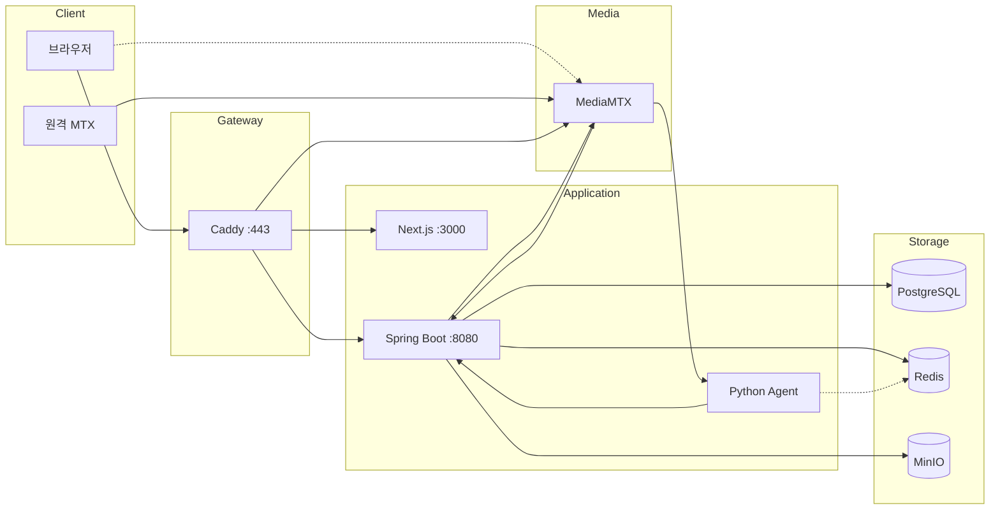

# AEGIS Infrastructure

> Agent 기반 안전 모니터링 시스템 - 인프라 구성

## 개요

AEGIS Infrastructure는 Docker Compose 기반의 인프라 구성으로, 리버스 프록시, 미디어 서버, 데이터베이스, 오브젝트 스토리지, 캐시를 포함합니다.

## 시스템 아키텍처

### 전체 구성도



### 서비스 포트

| 서비스 | 포트 | 설명 |
|--------|------|------|
| Caddy | 443 | HTTPS 리버스 프록시 |
| Next.js | 3000 | 프론트엔드 |
| Spring Boot | 8080 | 백엔드 API |
| Python Agent | - | AI 분석 (포트 미노출) |
| PostgreSQL | 5432 | 데이터베이스 |
| Redis | 6379 | 캐시/토큰/Pub-Sub |
| MinIO API | 9000 | 클립 스토리지 |
| MinIO Console | 9001 | 웹 관리 콘솔 |

### MediaMTX 포트

| 프로토콜 | 포트 | 용도 |
|----------|------|------|
| SRT | 8890/udp | 원격 MTX에서 스트림 수신 |
| WebRTC WHEP | 8889 | 시그널링 |
| WebRTC ICE | 8189/udp | 미디어 |
| HLS | 8888 | Spring 클립 추출용 (내부) |
| RTSP | 8554 | Python Agent 프레임 캡처용 (내부) |
| API | 9997 | 카메라 목록 조회 |

## 워크플로우

### WebRTC 스트리밍 흐름

```
1. 브라우저 → Spring Boot: GET /api/cameras → 카메라 목록 + streamUrl 반환
2. 브라우저 → MediaMTX: POST /stream/{cam}/whep + Authorization: Basic base64(_:jwt)
3. MediaMTX → Spring Boot: POST /internal/mediamtx/auth (password=jwt)
4. Spring Boot: JWT 검증 → 카메라 접근 권한 확인
5. 브라우저 ↔ MediaMTX: UDP ICE 직접 연결 (DTLS 암호화)
```

### 카메라 동기화 흐름

```
1. 원격 MTX → MediaMTX: SRT 스트림 송출
2. MediaMTX: runOnReady 훅 실행
3. MediaMTX → Spring Boot: POST /internal/mediamtx/sync
4. Spring Boot → MediaMTX: GET /v3/paths/list
5. Spring Boot → PostgreSQL: 카메라 INSERT/UPDATE
6. Spring Boot → Redis: 분석 카메라 목록 저장 (analysis:cameras)
7. Spring Boot → Redis: Pub/Sub camera:analysis:update 발행
8. Spring Boot → 브라우저: SSE camera 이벤트
```

### AI 분석 흐름

```
1. Agent: Redis camera:analysis:update 채널 구독
2. Agent: Redis에서 분석 카메라 목록 조회 (GET analysis:cameras)
3. Agent: RTSP로 MediaMTX에 직접 연결 (rtsp://localhost:8554/{cam}, 인증 없음)
4. Agent: 1fps 캡처, 640x360 리사이즈, 8프레임 버퍼링
5. Agent: LangGraph 분석 파이프라인 실행
6. Agent → Spring Boot: POST /internal/agent/events → Event 생성 (클립 자동 추출)
7. Agent → Spring Boot: PATCH /internal/agent/events/{id}/analysis → 분석 결과 추가
```

### 인증 흐름

```
1. 로그인 → Access Token (응답 body) + Refresh Token (Redis + Cookie)
2. API 호출 → Authorization: Bearer {accessToken}
3. 401 응답 → Refresh Token으로 갱신 시도
4. 갱신 실패 → /auth로 리다이렉트
```

## 아키텍처 (ASCII)

```
                    ┌─────────────────────────────────────────┐
                    │              Caddy (443)                │
                    │           리버스 프록시, HTTPS           │
                    └────────────────┬────────────────────────┘
                                     │
            ┌────────────────────────┼────────────────────────┐
            │                        │                        │
            ▼                        ▼                        ▼
    ┌───────────────┐      ┌─────────────────┐      ┌─────────────────┐
    │   Frontend    │      │    Backend      │      │   MediaMTX      │
    │   (3000)      │      │    (8080)       │      │  (8889/8554)    │
    │  host.docker  │      │  host.docker    │      │                 │
    └───────────────┘      └────────┬────────┘      └─────────────────┘
                                    │
                    ┌───────────────┼───────────────┐
                    │               │               │
                    ▼               ▼               ▼
            ┌───────────┐   ┌───────────┐   ┌───────────┐
            │ PostgreSQL│   │   Redis   │   │   MinIO   │
            │  (5432)   │   │  (6379)   │   │(9000/9001)│
            └───────────┘   └───────────┘   └───────────┘
```

## 서비스 구성

### docker-compose.yml

| 서비스 | 이미지 | 포트 | 설명 |
|--------|--------|------|------|
| caddy | caddy:latest | 443 | 리버스 프록시, HTTPS |
| mediamtx | aegis-mediamtx:latest | 9997, 8554, 8889, 8189/udp, 8890/udp, 8888 | 미디어 서버 |
| postgres | postgres:latest | 5432 | 데이터베이스 |
| minio | minio/minio:latest | 9000, 9001 | 오브젝트 스토리지 |
| redis | redis:latest | 6379 | 캐시 |

## 네트워크

- **네트워크 이름**: `aegis`
- **드라이버**: bridge
- **호스트 접근**: `host.docker.internal`

## Caddy (리버스 프록시)

### 포트

- **443**: HTTPS (TLS internal - 자체 서명 인증서)

### Caddyfile 라우팅

```
localhost {
    tls internal

    # Backend API
    handle /api/* {
        reverse_proxy host.docker.internal:8080
    }

    # MediaMTX WebRTC
    handle /stream/* {
        uri strip_prefix /stream
        reverse_proxy aegis-mediamtx:8889
    }

    # Frontend
    handle {
        reverse_proxy host.docker.internal:3000
    }
}
```

### 볼륨

| 호스트 | 컨테이너 | 설명 |
|--------|----------|------|
| ./Caddyfile | /etc/caddy/Caddyfile | 설정 파일 |
| ./caddy_data | /data | 인증서 등 |
| ./caddy_config | /config | 설정 캐시 |

## MediaMTX (미디어 서버)

### 포트

| 포트 | 프로토콜 | 용도 |
|------|----------|------|
| 9997 | TCP | API |
| 8554 | TCP | RTSP (Python Agent 프레임 캡처) |
| 8889 | TCP | WebRTC WHEP (Frontend 스트리밍) |
| 8189 | UDP | WebRTC ICE |
| 8890 | UDP | SRT (외부 스트림 수신) |
| 8888 | TCP | HLS (클립 추출) |

### mediamtx.yml 설정

```yaml
# 로그
logLevel: info

# API
api: yes
apiAddress: :9997

# 프로토콜
srt: yes          # 외부 스트림 수신
webrtc: yes       # Frontend 실시간 스트리밍
rtsp: yes         # Python 프레임 캡처
hls: yes          # Spring 클립 추출
rtmp: no          # 미사용

# HLS 녹화 설정
hlsVariant: fmp4
hlsSegmentDuration: 3s
hlsSegmentCount: 10
hlsSegmentMaxSize: 10M
hlsDirectory: /recordings

# 인증 (Spring Backend 위임)
authMethod: http
authHTTPAddress: http://host.docker.internal:8080/internal/mediamtx/auth

# 스트림 이벤트 훅
paths:
  all:
    runOnReady: curl -s -X POST http://host.docker.internal:8080/internal/mediamtx/sync
    runOnNotReady: curl -s -X POST http://host.docker.internal:8080/internal/mediamtx/sync
```

### Dockerfile.mediamtx

커스텀 빌드 (curl 포함):

```dockerfile
FROM bluenviron/mediamtx:latest
RUN apk add --no-cache curl
```

### 인증 설정

모든 인증을 Spring Boot로 위임하여 통합 관리합니다.

**프로토콜별 인증 처리:**

| 프로토콜 | action | 인증 방식 | 설명 |
|----------|--------|-----------|------|
| SRT | publish | ID/PW | `streamid=publish:path:user:password` 형식 |
| RTSP | read | 없음 | Python Agent 프레임 캡처용 (내부) |
| HLS | read | 없음 | Spring 클립 추출용 (내부) |
| WebRTC | read | JWT | Basic Auth password 필드에 JWT 전달 |

**SRT 송출 URL 형식:**

```
srt://host:8890?streamid=publish:카메라명:사용자:비밀번호
```

예시: `srt://host:8890?streamid=publish:cam1:aegis:trillion`

**HLS 클립 설정:**

| 설정 | 값 | 설명 |
|------|-----|------|
| hlsSegmentCount | 10 | 유지 세그먼트 수 |
| hlsSegmentDuration | 3s | 세그먼트 길이 |
| hlsSegmentMaxSize | 10M | 세그먼트 최대 크기 |

→ 3초 × 10개 = 최근 30초 보관 (Spring에서 이벤트 발생 시 클립 추출)

### 볼륨

| 호스트 | 컨테이너 | 설명 |
|--------|----------|------|
| ./mediamtx.yml | /mediamtx.yml | 설정 파일 |
| ./recordings | /recordings | HLS 녹화 파일 |

## PostgreSQL

### 포트

- **5432**: PostgreSQL 기본 포트

### 환경 변수

| 변수 | 값 |
|------|-----|
| POSTGRES_USER | aegis |
| POSTGRES_PASSWORD | trillion |
| POSTGRES_DB | aegis |

### 볼륨

| 호스트 | 컨테이너 | 설명 |
|--------|----------|------|
| ./postgres_data | /var/lib/postgresql | 데이터 |

## MinIO (S3 호환 스토리지)

### 포트

| 포트 | 용도 |
|------|------|
| 9000 | S3 API |
| 9001 | 웹 콘솔 |

### 환경 변수

| 변수 | 값 |
|------|-----|
| MINIO_ROOT_USER | aegis |
| MINIO_ROOT_PASSWORD | trillion |

### 볼륨

| 호스트 | 컨테이너 | 설명 |
|--------|----------|------|
| ./minio_data | /data | 데이터 |

### 버킷

- **aegis-clips**: 이벤트 클립 저장

## Redis

### 포트

- **6379**: Redis 기본 포트

### 볼륨

| 호스트 | 컨테이너 | 설명 |
|--------|----------|------|
| ./redis_data | /data | 데이터 (dump.rdb) |

### 용도

- Refresh Token 저장
- MediaMTX 동기화 잠금
- 분석 카메라 목록
- Pub/Sub (AI Agent 알림)

## 볼륨 및 데이터 관리

### 디렉토리 구조

```
aegis-infra/
├── Caddyfile
├── docker-compose.yml
├── Dockerfile.mediamtx
├── mediamtx.yml
├── caddy_config/       # Caddy 설정 캐시
├── caddy_data/         # Caddy 인증서
├── minio_data/         # MinIO 데이터
│   └── files/
│       └── aegis-clips/
├── postgres_data/      # PostgreSQL 데이터
├── recordings/         # MediaMTX HLS 녹화
└── redis_data/         # Redis 데이터
    └── dump.rdb
```

### 데이터 초기화

```bash
# 모든 데이터 삭제 (주의!)
rm -rf postgres_data/* minio_data/* redis_data/*
```

## 실행 방법

### 시작

```bash
# 전체 서비스 시작
docker-compose up -d

# 로그 확인
docker-compose logs -f

# 특정 서비스 로그
docker-compose logs -f caddy
```

### 중지

```bash
# 전체 서비스 중지
docker-compose down

# 볼륨까지 삭제
docker-compose down -v
```

### 재빌드

```bash
# MediaMTX 이미지 재빌드
docker-compose build mediamtx
docker-compose up -d mediamtx
```

## 외부 서비스 연결

### Frontend (host.docker.internal:3000)

```bash
cd ../aegis-frontend
pnpm dev
```

### Backend (host.docker.internal:8080)

```bash
cd ../aegis-backend
./gradlew bootRun
```

### AI Agent

```bash
cd ../aegis-ai-agent
python -m src.app
```

## 접속 URL

| 서비스 | URL |
|--------|-----|
| Frontend | https://localhost |
| Backend API | https://localhost/api |
| WebRTC 스트림 | https://localhost/stream/{camera}/whep |
| MinIO 콘솔 | http://localhost:9001 |
| MediaMTX API | http://localhost:9997 |

## 문제 해결

### Caddy 인증서 오류

```bash
# 인증서 재생성
rm -rf caddy_data/caddy/certificates
docker-compose restart caddy
```

### MediaMTX 동기화 실패

```bash
# 수동 동기화 트리거
curl -X POST http://localhost:8080/internal/mediamtx/sync
```

### PostgreSQL 연결 실패

```bash
# 컨테이너 상태 확인
docker-compose ps postgres

# 로그 확인
docker-compose logs postgres
```

### Redis 연결 실패

```bash
# Redis CLI 접속
docker exec -it aegis-redis redis-cli

# 키 확인
keys *
```
